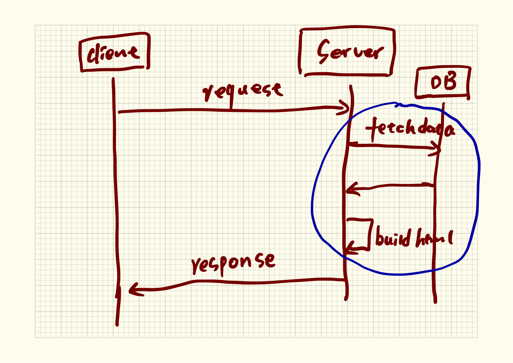

# 渲染时机

什么是渲染？想要理解渲染就要理解整个从html生成到html显示的过程。早些时候，当用户通过浏览器访问网站时，Web服务器生成html页面并返回给浏览器，浏览器拿到html页面后，把html渲染成可视化的网页。从这个角度理解，渲染只是浏览器做的事情。

但是从今天的WebApp的发展来看，渲染主要指根据数据来构建html文件，而忽略掉浏览器将html渲染成可视化页面。这一点认知很重要。

在处理WebApp时，html页面构成的时机主要有两种。

1. 【服务器渲染】在服务器端用数据构建好页面后，再给客户端。
2. 【客户端渲染】服务器先给一个基本页面模板，然后由浏览器发起数据请求，获得数据后浏览器重新依据获得的数据再渲染页面。

这两种渲染时机存在本质的区别。

#### 服务器渲染

服务器渲染技术意味着整个页面的构建都是在服务端完成。

当用户通过浏览器发起一个打开网页的请求，WebApp收到请求后，会先去数据库抓取页面要显示的数据，然后根据数据来构建html，再返回给用户。

这种处理的特点是，构建整个页面的所有处理时间都在服务端。这个时间包括从数据库抓取数据和由数据构建html页面。

假如数据量大，或者构建页面的处理逻辑复杂，势必就导致一个请求在服务器的处理时间变长。

把并发请求由1个变成100000个，那么 WebApp 的处理能力就很有压力，会导致宕机。

#### 客户端渲染

还是同样的案例，当用户通过浏览器发起一个打开网页的请求，WebApp收到请求后，立即给出页面模板，浏览器收到页面后，再去发起数据请求，浏览器页面获得数据后，在浏览器根据数据来渲染页面。

这种处理的特点是，WebApp 只需要返回一个基础页面的模板以及提供一个api供客户端抓取必要的数据。其余的都交给客户端处理。

这种处理至少减少了构建页面的处理逻辑，当然仅仅这个作用并不能完全给WebApp减轻压力。假如所有的瓶颈都是从数据库抓数据引起的，减轻服务端渲染页面的时间并不是很见效。

从某种意义上讲，数据库的处理时间不管是采用服务器渲染还是客户端渲染都没办法改变它的性能。这是一个专门的知识点。但至少客户端显然能减轻WebApp的一部分压力。甚至如果把页面模板部署到cdn节点上，服务器返回页面模板的处理压力就变成了0。

#### 如何选择用客户端渲染还是服务器渲染技术

这并没有一个特别的标准，主要还是看需求以及技术选型。

1. 如果想开发一个blog或者论坛，服务器渲染技术够用了，blog和论坛都是一些相对静止的数据。
2. 如果想开发一个公司的主站，就必须用服务器渲染（为啥必须？后面会说）
3. 如果想开发一个展示丰富化数据的页面，用客户端渲染，这样可以在客户端做出很多动态的交互。
4. 如果开发一个页面有很多权限控制的内容，比如，聊天页面有群主，群成员等等，用客户端渲染比较好。

总之，选技术要看业务和产品经验。甚至你也可以把客户端渲染和服务器渲染混合着用（一个页面部分内容由服务端渲染产生，部分内容由客户端渲染产生）。

#### 有必要考虑seo

seo的全称是 Search Engine Optimization（搜索引擎优化），当你开发的一个页面希望被搜索引擎（baidu，google）收录，似乎只能考虑服务器渲染技术。搜索引擎的爬虫系统在互联网上爬取页面数据就是往每个服务发请求，如果你的页面渲染技术是客户端渲染的，搜索引擎没办法解释你的页面并动态判断是否还存在部分内容要进一步的去服务端抓取数据。这势必就导致你的页面内容没办法被收录。

但是我们又不能为了被搜索引擎收录而全部采用服务端渲染，怎么办？这要从业务角度来做一些切分。

给你一个非常直观有效的判断依据：公司的主页请采用服务器渲染技术。其他的页面，看业务定。

