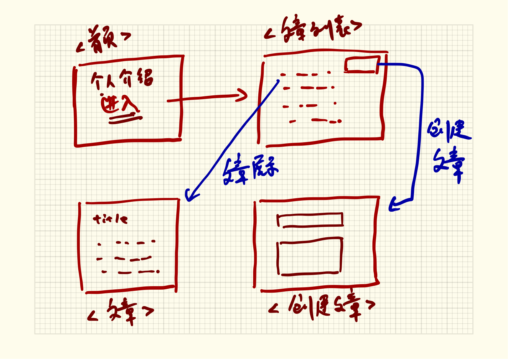

# 设计页面跳转

通过前面的小节，first-webapp具备以下路由和功能。

## 页面

路由|功能
---|---
[GET] / | 主页面
[GET] /posts | 文章列表页面
[GET] /posts/create | 创建文章页面
[GET] /posts/show | 显示文章页面

## API

路由|功能
---|---
[GET] /api/users | 创建项目时自带的功能（暂时留着）
[GET] /api/posts | 获取文章列表
[POST] /api/posts/create | 提交新文章

本节将对页面的结构进行串联，已达到更好的用户体验。

当要设计一个类似博客的客户端时，进入主页后，可以设计一个个人宣传页面，从个人宣传页面点击后进入到文章列表页面。文章列表页面不仅展示文章的列表，还会提供发表文章。点击文章列表的某个文章标题，可以直接进入到文章详情。



通过以上的交互，可以保证整个交互是通顺的。

## 跳转设计

在views/index.ejs中，引入bootstrap的[巨幕](http://v3.bootcss.com/components/#jumbotron)样式。

#### views/index.ejs 引入bootstrap

```html
<head>
  <title><%= title %></title>
  <link href="https://cdn.bootcss.com/bootstrap/3.3.6/css/bootstrap.min.css" rel="stylesheet">
  <link rel='stylesheet' href='/stylesheets/style.css' />
</head>
```

#### 在主页增加巨幕样式

views/index.ejs 

```html
<body>
  <div class="container">
    <div class="col-md-8 col-md-offset-2">
      <div class="jumbotron">
        <h1>Hello, world!</h1>
        <p>这是我记忆空间。</p>
        <p><a class="btn btn-primary btn-lg" href="/posts" role="button">进入新世界</a></p>
      </div>
    </div>
  </div>
</body>
```

在巨幕中有一个`<a>`标签，用于跳转到文章列表页面。

#### 需改全局 `<body>` 的背景

在全局 body 里添加background，给所有页面添加一个背景图片，以保证页面更好看一些。

public/stylesheets/style.css

```css
body {
  padding: 50px;
  font: 14px "Lucida Grande", Helvetica, Arial, sans-serif;
  background: #E6CCA6 url(../images/bg.png) repeat fixed;
}
```

#### 修改文章列表样式

用 bootstrap种的 [list-group](http://v3.bootcss.com/components/#list-group) 组件来展示文章的列表

views/posts.ejs

```html
<ul class="list-group" v-for="item in postsList">
  <li class="list-group-item">
    <a v-bind:href="item.url">{{ item.title }}</a>
  </li>
</ul>
```

#### 在文章列表添加新建文章的按钮

案例使用的是[分列式下拉菜单按钮](http://v3.bootcss.com/components/#btn-groups)

```html
<!-- Split button -->
<div class="btn-group pull-right">
  <button type="button" class="btn btn-default">操作</button>
  <button type="button" class="btn btn-default dropdown-toggle" data-toggle="dropdown" aria-haspopup="true" aria-expanded="false">
    <span class="caret"></span>
    <span class="sr-only">Toggle Dropdown</span>
  </button>
  <ul class="dropdown-menu">
    <li><a href="/posts/create">新建</a></li>
  </ul>
</div>
```

上面在最外层 `<div>` 中额外增加了一个pull-right，目的是让分列式下拉菜单靠右边显示。

分列式菜单想正确显示，必须引入jquery.js 和 bootstrap.js

```html
<script src="https://cdn.bootcss.com/jquery/2.2.4/jquery.min.js"></script>
<script src="https://cdn.bootcss.com/bootstrap/3.3.6/js/bootstrap.min.js"></script>
```

#### 调整编辑页面布局

保证页面占栅格系统的8格，并且居中显示。

views/create.ejs

```html
<div class="container">
  <div class="col-md-8 col-md-offset-2">
  ......
  </div>
</div>
```

#### 调整文章显示页面布局

保证页面占栅格系统的8格，并且居中显示。

views/show.ejs

```html
<div class="container">
  <div class="col-md-8 col-md-offset-2">
  ......
  </div>
</div>
```

## 事例

参考事例 [first-app-sample-11](https://github.com/xugy0926/learn-webapp-sample/tree/master/first-app-sample-11)


