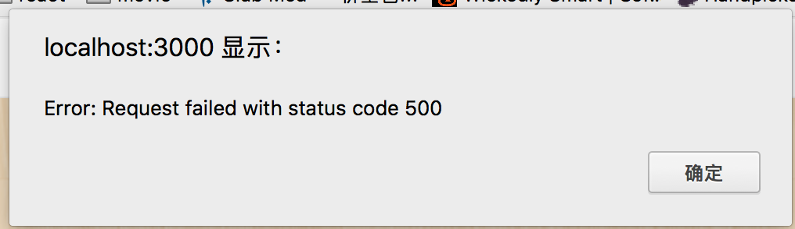

# 更好的错误处理中枢

进入登录页面，输入错误的账号和密码。会得到以下提示。



这个错误提示信息非常不友好，无法获知到底是账号错误还是密码错误。

在处理登录的地方，代码明确给出了错误信息。

```js
// filepath: route.api.js

/* POST signin user */
router.post('/signin', function(req, res, next) {
  var name = req.body.name || '';
  var pass = req.body.pass || '';

  UserModel.findOne({ name }, function(err, user) {
    if (err || !user) {
      return next(new Error('找不到用户'));
    } else {
      var isOk = bcrypt.compareSync(pass, user.pass);
      if (!isOk) {
        return next(new Error('密码不对'));
      }

      var authToken = user._id;
      var opts = {
        path: '/',
        maxAge: 1000 * 60 * 60 * 24 * 30, // cookie 有效期30天
        signed: true,
        httpOnly: true
      };

      res.cookie(config.cookieName, authToken, opts);
      res.end();
    }
  });
});
```

那为什么在前端页面并没有给出相应的提示呢？

通过 express 命令默认创建的项目，给了一个错误处理函数。

```js
// error handler
app.use(function(err, req, res, next) {
  // set locals, only providing error in development
  res.locals.message = err.message;
  res.locals.error = req.app.get('env') === 'development' ? err : {};

  // render the error page
  res.status(err.status || 500);
  res.render('error');
});
```

这个错误处理最终回 `render` 一个错误的页面。如果是在浏览器地址栏输入一个错误的理由返回一个错误页面是合理的，但是通过 `axios` 的请求还返回一个错误页面就不合理。

一般情况下，通过 `axios` 的请求得到一个错误，希望要一个错误信息，这个错误提示信息可以是 `json` 格式、字符串等，但最好不要是一个错误页面。

#### 拓展错误中枢

```js
app.use(function(err, req, res, next) {
  // set locals, only providing error in development
  res.locals.message = err.message || err;
  res.locals.error = req.app.get('env') === 'development' ? err : {};

  // the error response
  res.status(err.status || 500);
  res.format({
    json() {
      res.send({error: err.toString()});
    },

    html() {
      res.render('error');
    },

    default() {
      const message = `${errorDetails}`;
      res.send(`500 Internal server error:\n${err.toString()}`);
    },
  });
});
```

将 `res.render()` 改成 [res.format()](http://www.expressjs.com.cn/4x/api.html#res.format)。

[res.format](http://www.expressjs.com.cn/4x/api.html#res.format) 内接受一个对象，该对象有三个函数 `json()` `html()` `default()`。

如果是通过浏览器地址输入的路由出现错误，会把 html() 里的错误信息给到浏览器，如果是通过 axios 请求出现的错误，会把 json() 返回给 axios，如果是这两种情况之外的，会把 default() 返回给对方。

这样能保证通过 axios 请求获得一个 `json` 格式的错误信息。

#### 改造 axios 的错误处理

```js
// filepath: views/singin.ejs

axios.post('/api/v1/signin',
  {
    name: vm.name,
    pass: vm.pass
  })
  .then(function(response) {
    return response.data;
  })
  .then(function(data) {
    window.location = '/';
  })
  .catch(function(err) {
    // 直接弹出 error 信息
    alert(err.response.data.error);
  })
```

其他页面的错误处理也一样修改。

最后，重复本文开头的操作。你会获得以下友好提示。


## 实例

参考 [first-app-sample-19](https://github.com/xugy0926/learn-webapp-sample/tree/master/first-app-sample-19)
